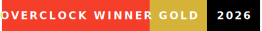
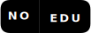

  

  

  
  &nbsp;
  
  &nbsp;
  

---

## In the Lab

Private until they ship. Public drops land in [Research](https://github.com/zeiddata-dev/Research).

| Project | What it is | Status |
| :-- | :-- | :-- |
| **Lithium** | Evidence-first monitoring dashboard and bot environment | `internal` |
| **EQ** | Multi-user evidence and policy platform | `building` |
| **Threat Dashboard** | Admin visibility dashboards over live telemetry | `building` |
| **Messaging Platform** | Self-hosted secure messaging stack | `building` |

---

## Research Lab

| Area | What it gives you |
| :-- | :-- |
| [Detections](https://github.com/zeiddata-dev/Research/tree/main/detections) | KQL, Sigma, SPL, and signal logic. Deploy them. Tell me what's missing. |
| [Automation](https://github.com/zeiddata-dev/Research/tree/main/tools/scripts) | Validators, collectors, and helper scripts. PRs welcome. |
| [Workbooks](https://github.com/zeiddata-dev/Research/tree/main/workbooks) | SOC-style dashboard and visual analytics artifacts. |
| [Research Notes](https://github.com/zeiddata-dev/Research/tree/main/research) | Malware research notes and public-safe writeups. |
| [Releases](https://github.com/zeiddata-dev/Research/releases) | Versioned drops of stable lab content. |

Open to contribution. See [CONTRIBUTING.md](./CONTRIBUTING.md) for the ground rules.

---

## Operating Rules

| Rule | |
| :-- | :-- |
| **Evidence first** | No claim ships without an artifact, log reference, or reproducible command. |
| **Defensive and authorized** | All work is scoped to authorized, public-safe security engineering. |
| **No secrets** | No credentials, private logs, or personal data in any project artifact. |
| **Automation is accountable** | Scripts explain what they read, what they changed, and what proves it worked. |
| **Disagree?** | [Open a discussion.](https://github.com/zeiddata-dev/Research/discussions/new/choose) Evidence required. |

---

  

  

---

## Skills, With Receipts

Every claim below links to a working artifact in the lab. No receipt, no row.

| Domain | Receipts |
| :-- | :-- |
| **Detection Engineering** | [KQL](https://github.com/zeiddata-dev/Research/tree/main/research/malware/claude/queries/sentinel) &nbsp;·&nbsp; [Sigma](https://github.com/zeiddata-dev/Research/tree/main/research/malware/claude/detections/sigma) &nbsp;·&nbsp; [SPL](https://github.com/zeiddata-dev/Research/tree/main/research/malware/claude/queries/splunk) &nbsp;·&nbsp; [YARA](https://github.com/zeiddata-dev/Research/tree/main/research/malware/claude/detections/yara) &nbsp;·&nbsp; [CVE packs](https://github.com/zeiddata-dev/Research/tree/main/detections/vendor-packs) |
| **SIEM & EDR Platforms** | [Microsoft Sentinel](https://github.com/zeiddata-dev/Research/tree/main/research/malware/claude/queries/sentinel) &nbsp;·&nbsp; [Splunk app](https://github.com/zeiddata-dev/Research/tree/main/content/vendors/Zeid%20Data%20Splunk%20App%20-%20Exfil%20Watch) &nbsp;·&nbsp; [Elastic](https://github.com/zeiddata-dev/Research/tree/main/content/vendors/island/zeid_data_elk_stack_connector) &nbsp;·&nbsp; [CrowdStrike](https://github.com/zeiddata-dev/Research/tree/main/content/vendors/crowdstrike) &nbsp;·&nbsp; [Cisco](https://github.com/zeiddata-dev/Research/tree/main/content/vendors/cisco) |
| **Automation & Tooling** | [Python](https://github.com/zeiddata-dev/Research/tree/main/tools/scripts/automation) &nbsp;·&nbsp; [C++](https://github.com/zeiddata-dev/Research/tree/main/tools/scripts/automation/zeid_data_sha256_manifest_cpp) &nbsp;·&nbsp; [Validators](https://github.com/zeiddata-dev/Research/tree/main/tools/validators) &nbsp;·&nbsp; [GitHub Actions](https://github.com/zeiddata-dev/zeiddata-dev/blob/main/.github/workflows/snake.yml) (this page builds itself) |
| **Threat Research** | [Qilin ransomware](https://github.com/zeiddata-dev/Research/tree/main/research/malware/qilin) &nbsp;·&nbsp; [PromptFlux / FruitShell](https://github.com/zeiddata-dev/Research/tree/main/research/malware/promptflux_fruitshell) &nbsp;·&nbsp; [White papers](https://github.com/zeiddata-dev/Research/tree/main/research/white-papers) |
| **SOC Operations** | [Playbooks & dashboards](https://github.com/zeiddata-dev/Research/tree/main/workbooks/dashboards/Security%20Operations%20Playbooks) for AWS, Okta, Palo Alto, CrowdStrike, Snowflake, and five more platforms |

---

<picture>
  <source media="(prefers-color-scheme: dark)" srcset="https://raw.githubusercontent.com/zeiddata-dev/zeiddata-dev/output/github-contribution-grid-snake-dark.svg" />
  <source media="(prefers-color-scheme: light)" srcset="https://raw.githubusercontent.com/zeiddata-dev/zeiddata-dev/output/github-contribution-grid-snake.svg" />
  
</picture>

  
  &nbsp;
  
  &nbsp;
  

  
  &nbsp;
  
  &nbsp;
  

Built for receipts. The lab light stays on.

